# Bubbly Meet
By [Daniel Ho](https://github.com/dwho0937wei-dotcom)

# Technologies
1. Frontend
   1. React
   2. Redux
   3. CSS
2. Backend
   1. Express
   2. Sequelize

## Overview
Welcome to **Bubbly Meet**! 
Want to bubbly group with new people and bubbly participate in events!
Bubbly Meet is just the platform that provides a place for individuals to form groups and post events for their corresponding group to participate!. 

When first entering into Bubbly Meet, this will be the first page you'll see, the home page!
You can see in the middle that you have the options to see all available groups or events, and to start a new group if you are logged in that is.
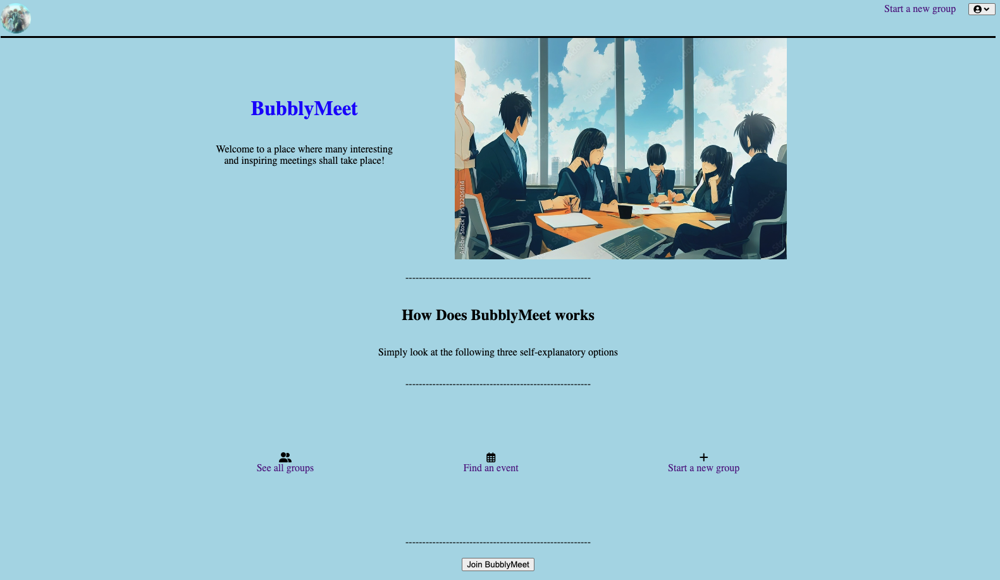

When you click on the profile button at the top right corner, you will see the options for logging in and signing up if you are logged out, and the option for logging out if you are logged in. You will also see the same options for viewing all available groups or events.
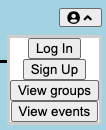
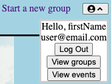

Both the login and signup buttons will open the modal for their respective functionality.
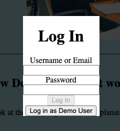
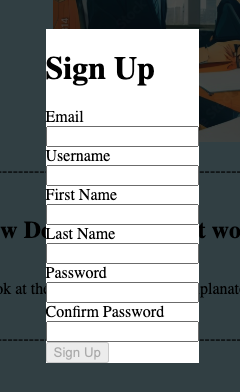

You will see all the available groups in this page!
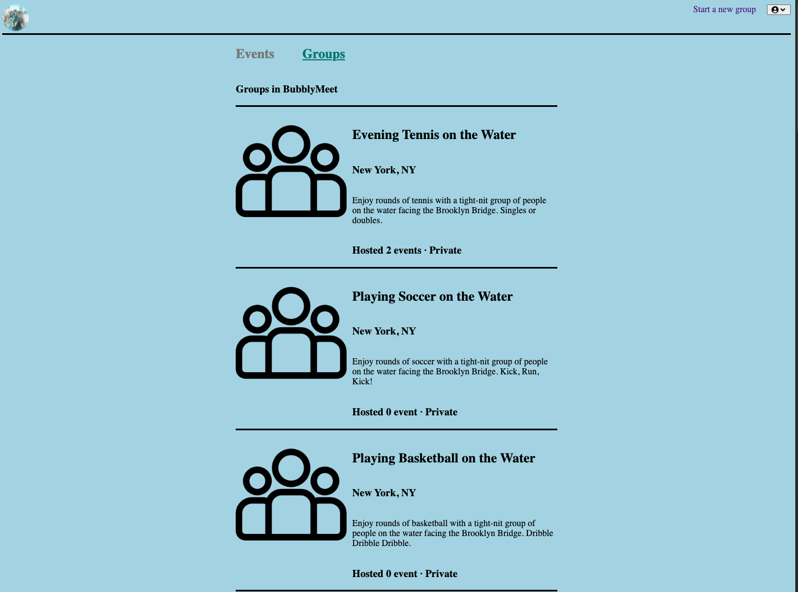
You can click one the groups to view its page as well as join the group!
You can also see events associated to the group which you can click on the enter its page!
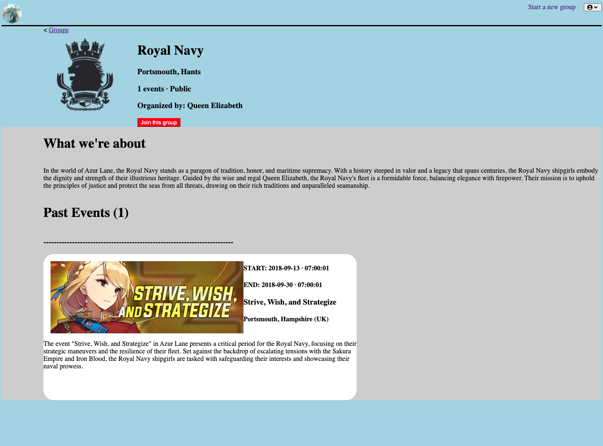

Here are what an event list page & the page of the one of the events itself look like!
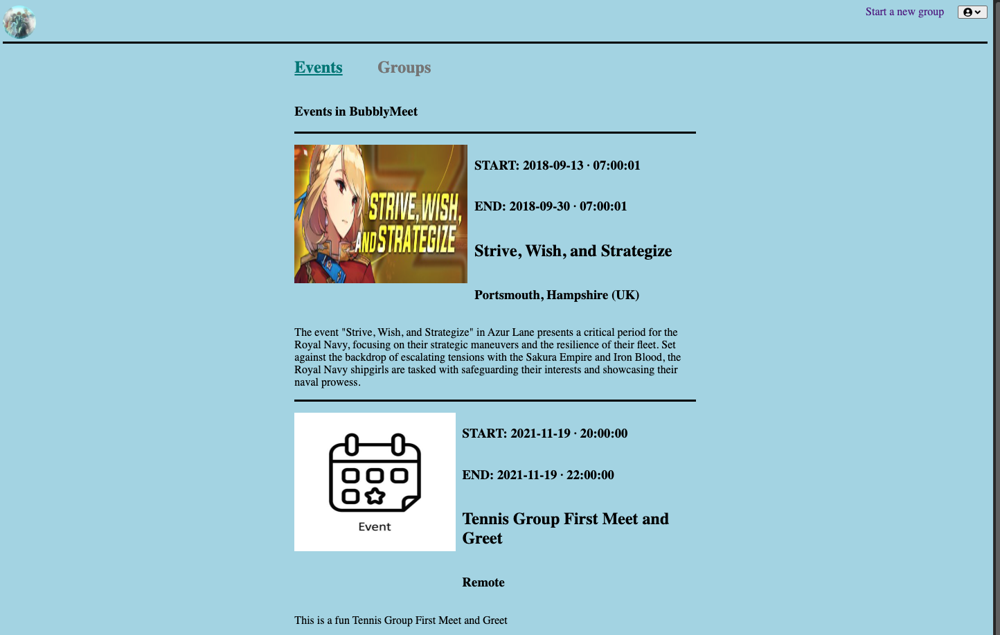
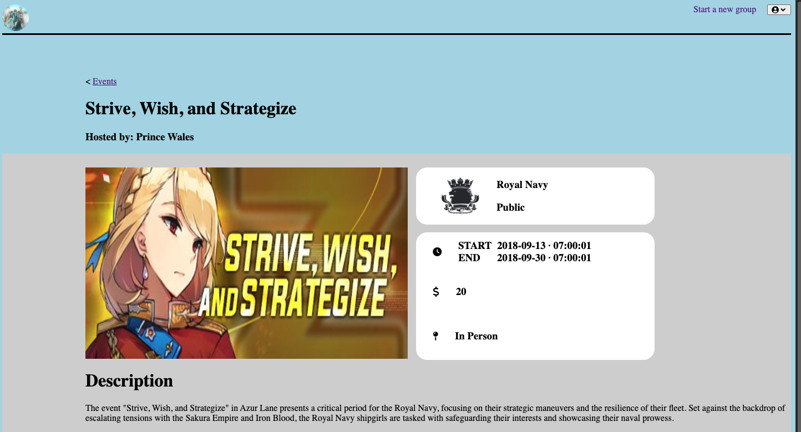

When creating a group, you will receive the following form for you to fill out.
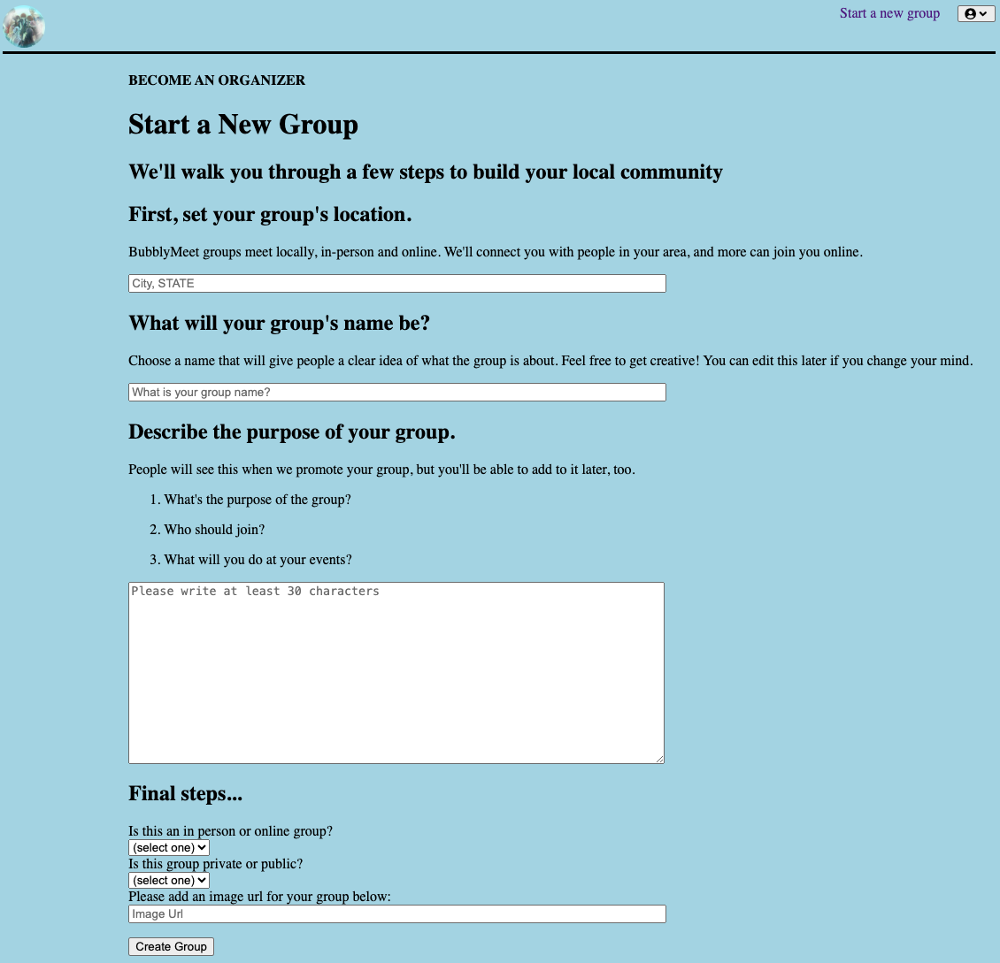
After creating a group, you will become the group leader and be immediately sent to your group page! As a leader, you can create a new event for the group, update the group profile page, or delete the group altogether!
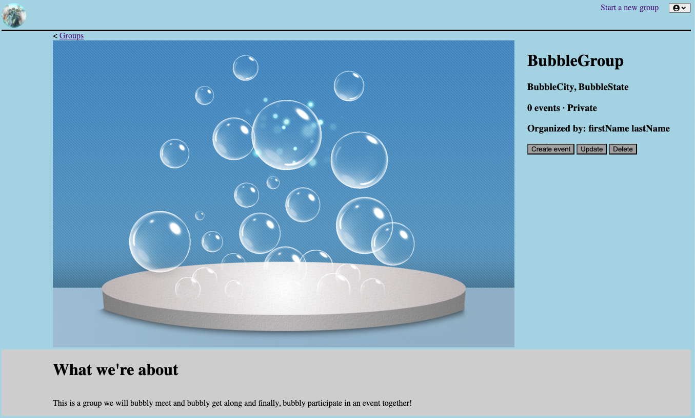
This is the form where you can update your group profile page!
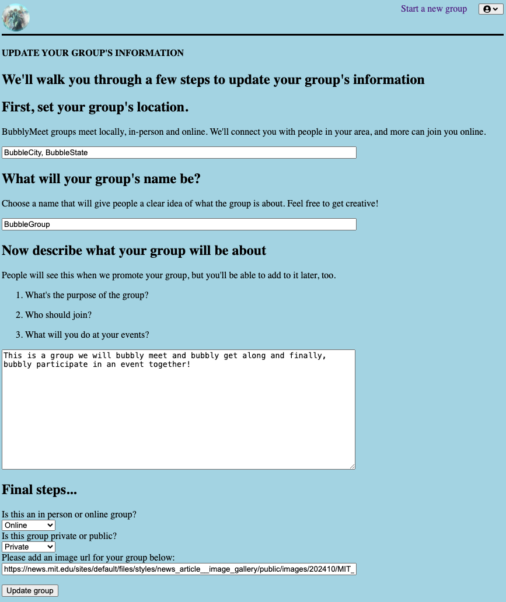

This will be the form for creating an event for your group!
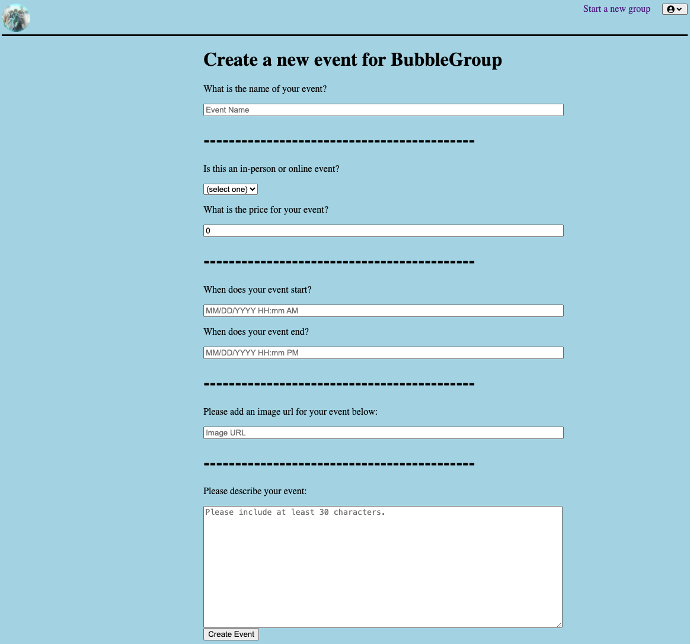
After creating the event, you will immediately be sent to your event page as the host!
As the host of the event, you can update or delete the event!
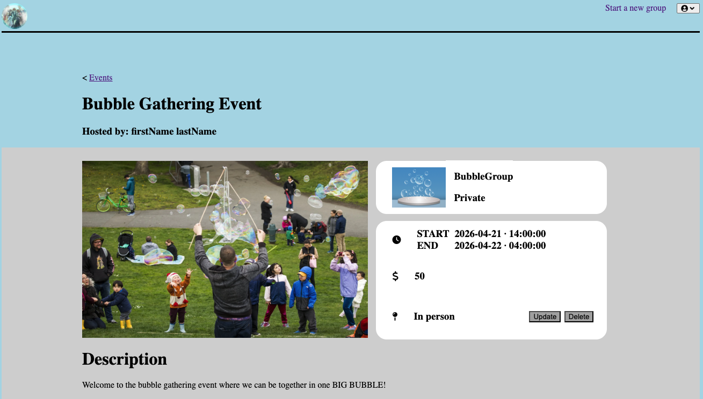